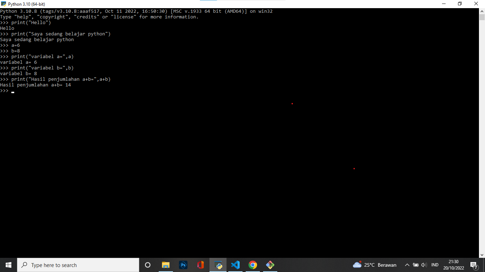
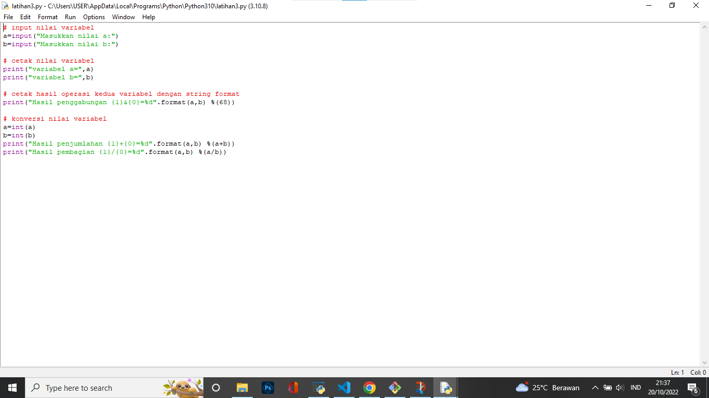
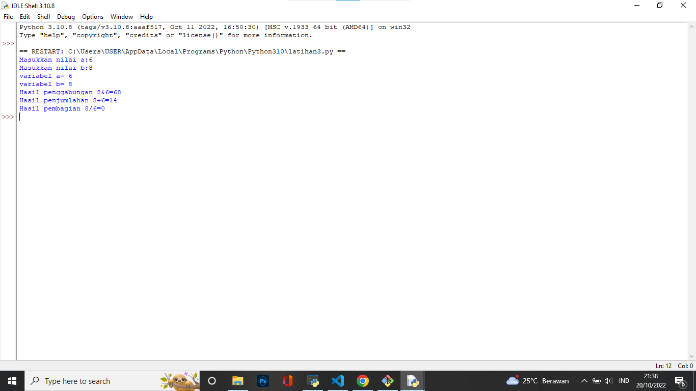
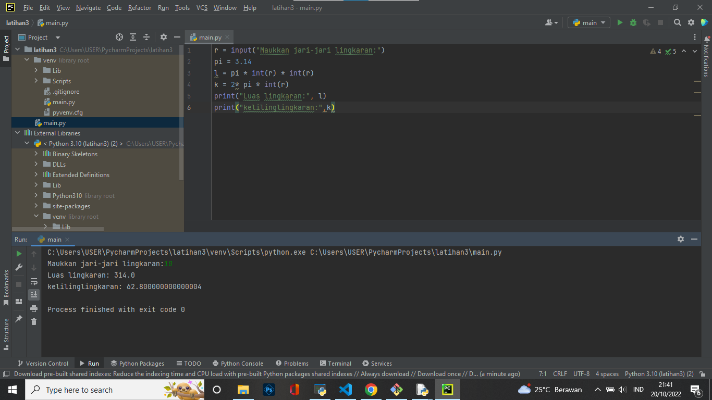

# lab2py
## latihan3 lab2py

### Langkah-langkah Menjalankan Python, IDLE, Dan PyCharm
### Langkah 1 
### Menjalankan Python Console 
### Menampilkan tulisan "Hello" di layar Dan Menampilkan tulisan "Saya Sedang Belajar Python" Harus Menggunakan Perintah "print"
contoh : 
print("Hello")
print("Saya Sedang Belajar Python")
### Menajulahkan dua buah bilangan menggunakan variabel a dan b
Mendefinisikan variabel a dengan nilai 8
Mendefinisikan variabel b dengan nilai 6
Mencetak hasil variabel a dan b
Mencetak hasil penjumlahan a+b
### Hasil Praktikum

### Menjalankan IDLE
### langkah 2
Membuat file baru dengan nama latihan3.py (pastikan lokasi file pada folder lab2py pada direktori kerja anda)
Menggunakan fungsi Input untuk mengambil nilai variabel dari keyboard
Dan di running
### Hasil Praktikum

### Menjalankan PyCarm
### Langkah 3
Create New Project
Latihan3
Dan Nama File main.py
### Hasil Praktikum
